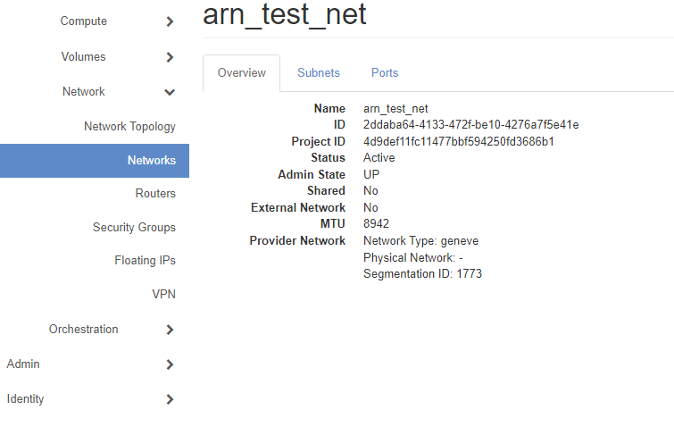

# Overview 

This repository contains bash scripts and ansible scripts that interface with OpenStack and manipulate the users project. These scripts cover the following topics:

- deploying instances using the command line interface 
- removing instances and their volumes 
- creating and configuring networks and routers
- installing scored services with ansible
- configuring users with ansible
- A small scale full deployment from scratch using ansible 
### General Setup 

- Follow all steps at [Get Started With Openstack](https://github.com/RIT-GCI-CyberRange/Openstack-Guides/wiki/How-to-get-started-with-Openstack)
- on your deployment box:
	- run the command ```ssh-keygen```
	- press `enter` for each prompt to leave defaults 
	- copy the contents of `~/.ssh/id_rsa.pub` to your computers clipboard *(must be done through ssh. Copy won't work on GUI console interface)*
- Go to the Openstack web interface:
	- navigate to Compute -> Key Pairs
	- click on "Import Public Key" 
	- name the key (for the following examples it is called Demo_Key) 
	- for "Key Type" select  "SSH Key"
	- paste the id_rsa.pub contents into the box
	- click "Import Public Key" on the bottom right 
- Download the files needed from the repo onto your deployment box

&nbsp;
# Bash Scripts 

### Additional Setup 
- On the deployment box run `sudo chmod +x <file name>` to make the files executables 

### **1) network_create.sh** 

This Bash script can be used to quickly deploy a network as well as a router that will have internet access through the external gateway. This is useful if you would like to start creating instances on a network other than MAIN-NAT. Make sure to change the code accordingly for your needs. The `--project` option should match your project name. All other option values are up to your discretion  and can be left as is. Ensure that if an option is changed in one spot, it is reflected through out the code. For example if you change the name of the network in the network create but not when attempting to connect the router, the code will fail.

To Run:
`./network_create.sh`

### **2) create_instances.sh** 

This Bash script can be used to quickly deploy instances in a project. There are a total of three machines deployed that all use the same image, and resources. Be sure to change the script to match your environment. 

Network ID Location:


- Specifically the `--nic` option must be changed to reflect your environment. The net-id must match the ID of the network you want to connect to. A seen in the image above in this example it would be `2ddaba64-4133-472f-be10-4276a7f5e41e`. Additionally the assigned IP addresses must match the subnet of the network you are connecting the machines to (if you use the network created from "network_create.sh" this range will be any ip within 192.168.0.0/24) . It is always recommended to create a separate network for multi-instance deployments rather than using MAIN-NAT. You may use the network created from "network_create.sh" above.

- Make sure to change the `--key-name` option to match that of the key imported under the  Setup section above

To Run: 
`./create_instances.sh`

### **3) delete_instances.sh** 

This Bash script can be used to quickly remove instances and their attached volumes in a project. This script will delete all instances and volumes except for instances specified by the user in the code. To Ensure that specific boxes are not deleted the following code must be changed:

```
if [ "$instance_name" == "Control-Node" ]; then
        echo "passing Control Node"
        continue
    fi
    
```

In the code above, if the name of the box equals "Control-Node" then it will be passed. This can be extended with "OR" operators or with additional elif statements. Ensure the spelling matches the name of your box exactly.

To test the code before actual execution, you may comment out both of the following lines:

` openstack server delete $id`

AND

`openstack volume delete $volume_id`

With both these lines commented out, the machine and volume will be printed but not deleted. This can help to double check that the intended result is as you expect.

To Run:
`./delete_instances.sh`


&nbsp;
# Ansible Scripts
&nbsp;
## **1) basic_setup.yml**
### Additional Setup 
- Install Ansible on your control node: `sudo apt install ansible -y`
- run `./create_instances.sh` to create the machines that basic_setup.yml will configure
- Ensure the control node is connected to the same network as the instances you want to configure.
	- This can be accomplished by adding an interface to the desired network from the OpenStack Web Interface. Navigate to Compute -> Instances.
 	- Click on the down arrow on the right side of the screen next to "Create Snapshot" for the desired instance. Click Attach Interface.
  	- Click on the dropdown under "Network*" and select the desired network you want to connect to. Click "Attach Interface on the bottom right
- ensure that basic_setup_inventory.ini is downloaded
- Optionally, you may skip all but the first additional step, and change the script and inventory files to reflect the environment you have deployed
	- you must ensure the instances are Debian based for the configuration to work correctly without further modification to the playbook
   
This ansible playbook is used to illustrate the basic functionality of ansible on pre-deployed instances. This playbook configures three seperate machines with three different commonly seen scored services. The services are as follows: apache2, MySQL, and vsftpd.  It only installs one service per machine, dependent on the IP address of the machine. It then adds two users to each machine. The usernames are `TestUser1` and `TestSudo1`. The password for both users is `password`. Finally, the playbook adds `TestSudo1` to the sudo group so they may run sudo commands.

To run:
`ansible-playbook -i basic_setup_inventory.ini basic_setup.yml `

&nbsp;

## **2) Deploy_Instances.yml**
### Additional Setup 
- Install Ansible on your control node: `sudo apt install ansible -y`
  
This ansible playbook is used to deploy instances into a project and connect them to a created network with internet access. This script will create one instance, create a router with internet access, create a network with a subnet, and then connect them together.

To run:
`ansible-playbook Deploy_instances.yml `
