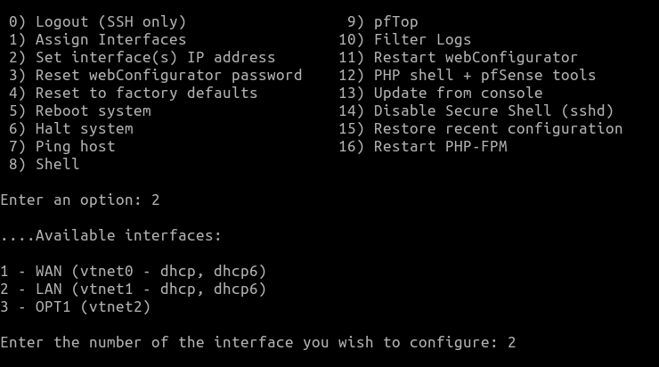

# README

This README provides instructions for setting up and configuring a pfSense routed network using the `pfsense_network.yml` Ansible script. It also covers additional required pfsense configurations for a wide open network with full routing and internet connection. This script is specifically for use with OpenStack environments. Using this method, port security in the environment will be disabled. This will allow for IP and MAC spoofing to be conducted in the environment.

## Requirements
- A deployment box with internet access on a custom network (will be isolated from created network after deployment)
- necessary allotted resources for deployment
- Openstack CLI and Ansible downloaded on deployment box.

## Instructions
1. Run the script with the supplied inventory file:
    ```
    ansible-playbook -i pfSense_network_inventory.ini pfSense_network.yml
    ```

2. Log into the net1 box console or connect net1 to the jumphost network and access via SSH. Use the following command to SSH into the pfSense router:
    ```
    ssh admin@192.168.1.254
    ```
    Use the password `pfsense` when prompted.

3. Assign Interfaces:
    - Type `1` for "Assign Interfaces".
    - 

    - Type `n` for "Should VLANs be set up now [y|n]?" (can be changed later).
    - In OpenStack, navigate to `instances -> pfsense -> interfaces` to view the MAC addresses for each port.
    - 

5. Configure Interfaces:
    - Set `net1` as the WAN interface.
    - Set `net2` as the LAN interface.
    - Set `net3` as the OPT1 interface.
    - 
6. Assign LAN IP:
    - Assign the LAN IP address by following the steps below:
      - 
      - Set the IP address to `192.168.2.254` with a `/24` subnet mask.
      - 
      - Press Enter through upstream gateways and IPv6 address for now. 
      - To configure DHCP make sure for the IP pools to leave out x.x.x.1 and x.x.x.254 as these will already be in use.
      - 

7. Set OPT1 Gateway:
    - Set the gateway for the OPT1 interface by following the steps below:
      - 
      - Set the IP address for the OPT1 interface.
      - 
      - Set the DHCP pools for OPT1.
      - 


8. Configure Firewall Rules:
    - Open a web browser on the net1_box and navigate to `http://192.168.1.254`.
    - Log in with the username `admin` and password `pfsense`.
    - Navigate to `Firewall -> Rules`.
    - 
    - Click the "Add" button (up arrow).
    - Change the Address Family to IPv4 and IPv6, and set the protocol to "Any".
    - 
    - Click "Save" at the bottom.
    - Repeat the above steps for both LAN and OPT1 interfaces, changing only the Interface section.
    - 
    - 
    - 
    - Click "Apply Changes" after creating all three rules.
    - 

9. Monitor and Reload Filter:
    - Click "Monitor".
    - 
    - Click "Reload Filter".
    - 
    - After completing these steps, the network should be able to communicate freely both internally as well as with the open internet.

## Final Topology


## NATing

By default, all internal traffic will be NATed using the WAN IP.


## Common Problems 

1) Error: 
```
Missing value auth-url required for auth plugin password
```
- Source into the Openstack .rc file for that project


2) LAN can't ping the internet but everything else can
    - Ensure that you follow the steps above and reconfigure the LAN interface even though it is pre-configured. pfSense does not correctly configure the LAN by default

3) You can ping the internet but can't resolve hostnames like google.com. 
     - You must configure the DNS resolver in pfSense and have the dns server of the host point to the router gateway.
     - Alternatively you can set the DNS server on the hosts directly to 8.8.8.8 (this will bypass the router DNS meaning it does not need to be configured)
